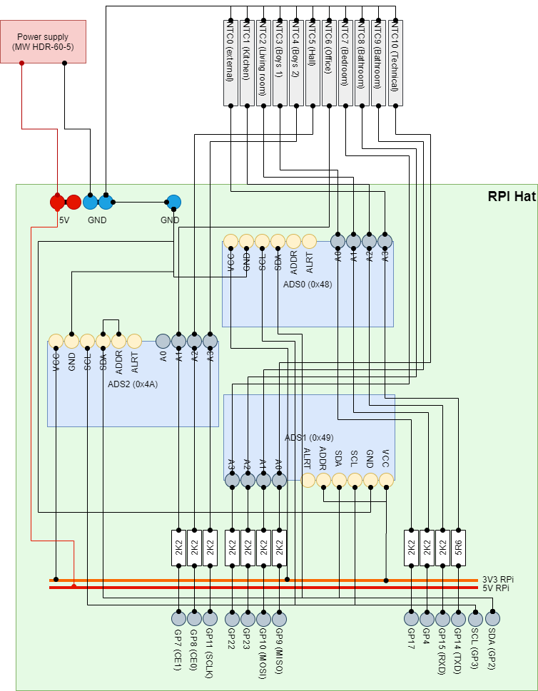
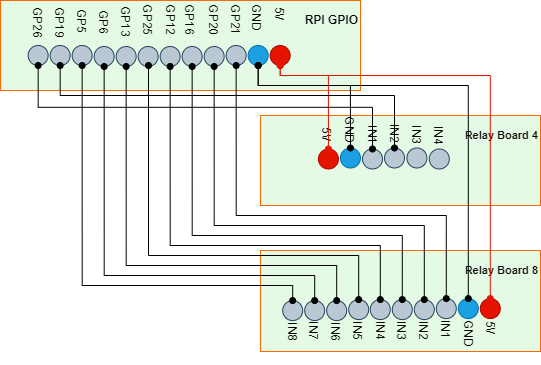
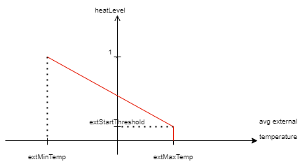

# HomeHeatControl
## Introduction
The goal of the project is to provide the heating control application for electrical floor
accumulating heating system. The system consists of heating cables in the floor - 10 sections:
- Circuit 1: Kitchen
- Circuit 2: Living room
- Circuit 3: Bedroom 1 (Boys)
- Circuit 4: Bedroom 2 (Boys)
- Circuit 5: Hall
- Circuit 6: Office
- Circuit 7: Parents' bedroom
- Circuit 8: Parents' bathroom
- Circuit 9: Bathroom
- Circuit 10: Technical room

Each circuit is powered by 230VAC.
Each section contains its own temperature sensor - NTC thermistor. Based on its resistance
the floor temperature is received. Additionally, external temperature sensor (also NTC thermistor) is installed.
Using both average external temperature and current floor temperatures
the application decides when to switch on the specific heating circuit. The application takes into account
the two-zones tariff setup and triggers heating only during 2nd (cheaper) zone. Additionally, it tries to
achieve the desired temperature at the end of the zone period. So, having 2nd tariff between 22:00-07:00 in the
night and then 13:00-16:00 during the day, the desired temperature should be achieved at 7:00 and then at 16:00.

## Hardware part
### Temperature measurement
The system is controlled by the Raspberry Pi extended with the ADC modules to measure resistance of the thermistors. 
The NTC factors for Steinhart-Hart equation are:
* A = 0.0012797372847331715
* B = 0.00026335882652276787
* C = 1.6897560208446226e-7

The dedicated RPi additional hat contains the measurement devices.
The thermistors are powered with 3.3VDC from RPi GPIO, connected serially with resistor, for
external sensor its value is 5.6kOhm, for all floor sensor value of each resistor is 2.2kOhm.
The NTC resistance is measured by the ADC (ADS1115) - three 4-channel modules are installed
and the measurement channels are connected between the known resistor and the NTC. The
figure below presents the schema of the temperature measurement part. The specific thermistor is powered only
during measurement time.



### Heating circuits switching
The actual heating is switched on and off by the relays organized in two boards - one with 8 relays,
second with 4 relays (2 are used). Those are relays powered with 5VDC from the power supply - it supplies
both RPi (via 5V and GND PINs) and relay boards and controlled with 3.3VDC from dedicated RPi GPIO PINs.
These relays does not directly open the heating circuits, but they control high-current connectors with 230VAC.



Each IN*i* input on the diagram opens the relay connected to appropriate connector controlling the specific heating
circuit.

## Software part
### General rules
Taking into account the average external temperature (average from recent ca. 24 hours) the system computes the
desired temperature level of each floor. This temperature is to be reached at the end of heating period. Because
of two-zone tariff, the heating may be switched only during 2nd (cheap) tariff. There is night part of 2nd zone
and day part (22-7 and 13-16 appropriately). The following parameters define the 2nd tariff boundaries, each
as HH-mm-ss (example: 22:01:00)
* `nightStartTime` - the start time of the night zone
* `nightEndTime` - the end time of the night zone 
* `dayStartTime` - the start time of the day zone
* `dayEndTime` - the end time of the day zone

The application computes the heating level of heating based on external temperature. The following parameters
define the level:
* `extMinTemp` - at this external temperature the heating level gets 1.0 (full)
* `extMaxTemp` - at this external temperature the heating starts - the level gets 0.0, but can be increased by `extStartThreshold`
* `extStartThreshold` - this parameter define the heating start level, so instead of 0.0 at `extMaxTemp` the level will
   be set to this level

The diagram below describes the levels.




### Controlling temperature in a specific room
Having the heating level, the application tries to switch the heating in the way, that the desired temperature is reached at
the end of the 2nd tariff zone period (night or day). The desired temperature in the reference to the base temperature,
defined as general parameter `tempBaseLevel`. For each heating circuit there's specific maximum temperature defined by
the parameter `maxTemp`.

Additionally, there're two optional parameters:
* `nightAdjust` - the value to modify heating level during the night period in 2nd tariff zone
* `dayAdjust` - the value to modify heating level during the day period in 2nd tariff zone

 Having those parameters, the desired temperature is computed as:
```desired temperature = tempBaseLevel + heating level * (maxTemp - tempBaseLevel) * (1 + nightAdjust)```

The heating characteristics defined by complex parameter `heatCharacteristics` define how fast the temperature of the
specific circuit grows when the heating is on. Those characteristics are linear within a defined segments. For example:
```
    heatCharacteristics:
      - tempMax: 20.0
        heatFactor: 8.3333e-4
      - tempMax: 23.0
        heatFactor: 9.4242-4
      - tempMax: 26.0
        heatFactor: 1.0e-3
      - tempMax: 30.0
        heatFactor: 1.1e-3
      - tempMax: 100.0
        heatFactor: 1.2e-3
```
This means:
1. Below 20 Celsius grades the temperature grows 8.3333e-4 grades per second
1. Between 20 and 23 grades the temperature grows 9.4242-4 grades per second
1. Between 23 and 26 grades the temperature grows 1.0e-3 grades per second
1. Between 26 and 30 grades the temperature grows 1.1e-3 grades per second
1. Over 30 (actually between 30 and 100 grades) the temperature grows 1.2e-3 grades per second

Each circuit has parameter `active` - it might have following values:
* `OFF` - the circuit is switched off
* `NIGHT` - the circuit heats during night only
* `DAY` - the circuit heats during day only
* `ALL` - the circuit heats during both periods in the cheap zone

Additional parameter `descritpion` - defines the name (informational only) of the heating circuit.